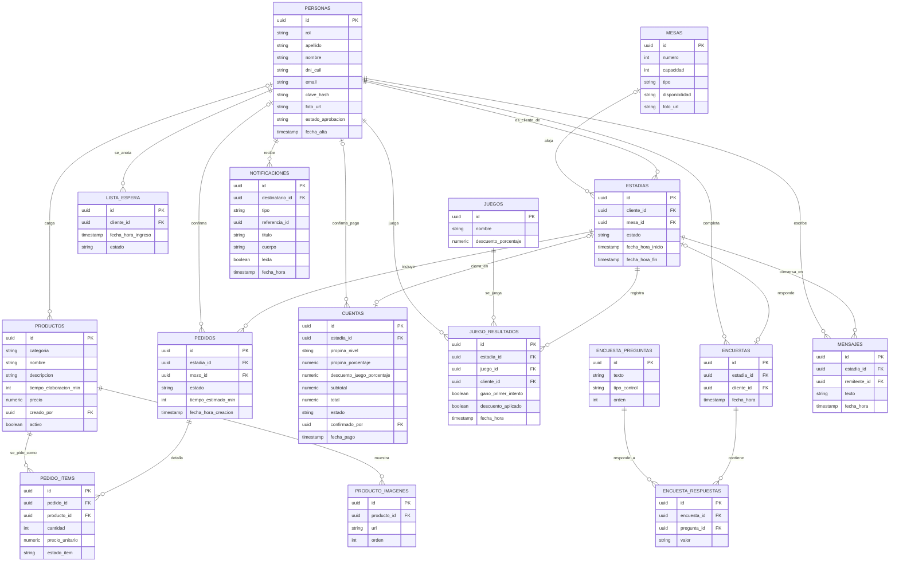

# Modelo de Datos — Primera entrega (puntos 1 a 22)

```mermaid
erDiagram
    PERSONAS ||--o{ ESTADIAS : es_cliente_de
    MESAS o|--o{ ESTADIAS : aloja
    PERSONAS ||--o{ LISTA_ESPERA : se_anota
    ESTADIAS ||--o{ PEDIDOS : incluye
    PERSONAS o|--o{ PEDIDOS : confirma
    PEDIDOS ||--o{ PEDIDO_ITEMS : detalla
    PRODUCTOS ||--o{ PEDIDO_ITEMS : se_pide_como
    PRODUCTOS ||--o{ PRODUCTO_IMAGENES : muestra
    PERSONAS o|--o{ PRODUCTOS : carga
    ESTADIAS o|--o| CUENTAS : cierra_en
    PERSONAS o|--o{ CUENTAS : confirma_pago
    ESTADIAS ||--o{ JUEGO_RESULTADOS : registra
    JUEGOS ||--o{ JUEGO_RESULTADOS : se_juega
    PERSONAS ||--o{ JUEGO_RESULTADOS : juega
    ESTADIAS o|--o| ENCUESTAS : responde
    PERSONAS ||--o{ ENCUESTAS : completa
    ENCUESTAS ||--o{ ENCUESTA_RESPUESTAS : contiene
    ENCUESTA_PREGUNTAS ||--o{ ENCUESTA_RESPUESTAS : responde_a
    ESTADIAS ||--o{ MENSAJES : conversa_en
    PERSONAS ||--o{ MENSAJES : escribe
    PERSONAS ||--o{ NOTIFICACIONES : recibe

    PERSONAS {
        uuid id PK
        string rol
        string apellido
        string nombre
        string dni_cuil
        string email
        string clave_hash
        string foto_url
        string estado_aprobacion
        timestamp fecha_alta
    }
    MESAS {
        uuid id PK
        int numero
        int capacidad
        string tipo
        string disponibilidad
        string foto_url
    }
    PRODUCTOS {
        uuid id PK
        string categoria
        string nombre
        string descripcion
        int tiempo_elaboracion_min
        numeric precio
        uuid creado_por FK
        boolean activo
    }
    PRODUCTO_IMAGENES {
        uuid id PK
        uuid producto_id FK
        string url
        int orden
    }
    LISTA_ESPERA {
        uuid id PK
        uuid cliente_id FK
        timestamp fecha_hora_ingreso
        string estado
    }
    ESTADIAS {
        uuid id PK
        uuid cliente_id FK
        uuid mesa_id FK
        string estado
        timestamp fecha_hora_inicio
        timestamp fecha_hora_fin
    }
    PEDIDOS {
        uuid id PK
        uuid estadia_id FK
        uuid mozo_id FK
        string estado
        int tiempo_estimado_min
        timestamp fecha_hora_creacion
    }
    PEDIDO_ITEMS {
        uuid id PK
        uuid pedido_id FK
        uuid producto_id FK
        int cantidad
        numeric precio_unitario
        string estado_item
    }
    CUENTAS {
        uuid id PK
        uuid estadia_id FK
        string propina_nivel
        numeric propina_porcentaje
        numeric descuento_juego_porcentaje
        numeric subtotal
        numeric total
        string estado
        uuid confirmado_por FK
        timestamp fecha_pago
    }
    JUEGOS {
        uuid id PK
        string nombre
        numeric descuento_porcentaje
    }
    JUEGO_RESULTADOS {
        uuid id PK
        uuid estadia_id FK
        uuid juego_id FK
        uuid cliente_id FK
        boolean gano_primer_intento
        boolean descuento_aplicado
        timestamp fecha_hora
    }
    ENCUESTAS {
        uuid id PK
        uuid estadia_id FK
        uuid cliente_id FK
        timestamp fecha_hora
    }
    ENCUESTA_PREGUNTAS {
        uuid id PK
        string texto
        string tipo_control
        int orden
    }
    ENCUESTA_RESPUESTAS {
        uuid id PK
        uuid encuesta_id FK
        uuid pregunta_id FK
        string valor
    }
    MENSAJES {
        uuid id PK
        uuid estadia_id FK
        uuid remitente_id FK
        string texto
        timestamp fecha_hora
    }
    NOTIFICACIONES {
        uuid id PK
        uuid destinatario_id FK
        string tipo
        uuid referencia_id
        string titulo
        string cuerpo
        boolean leida
        timestamp fecha_hora
    }
```
